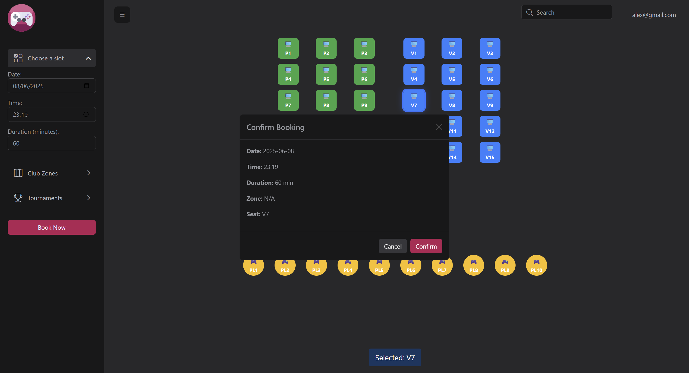
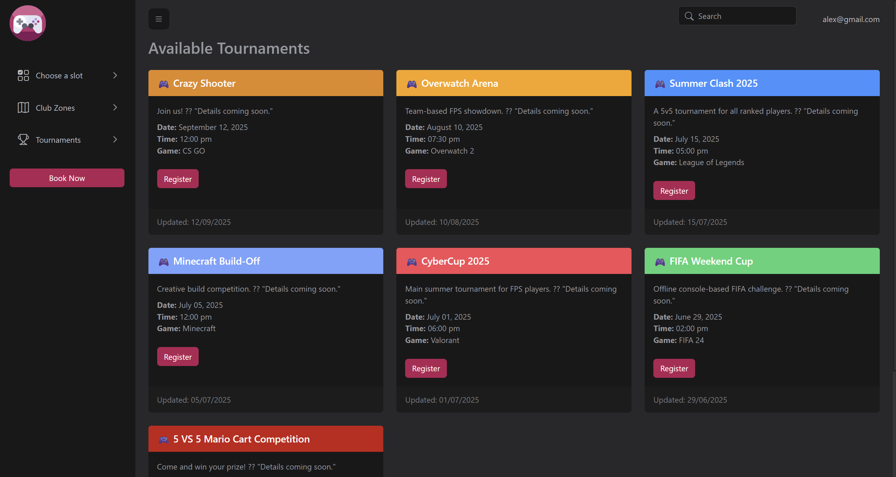
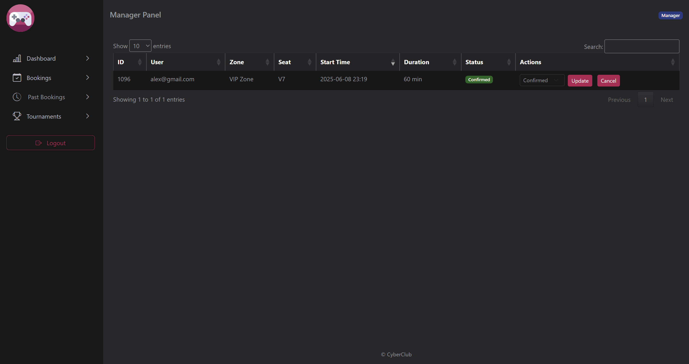
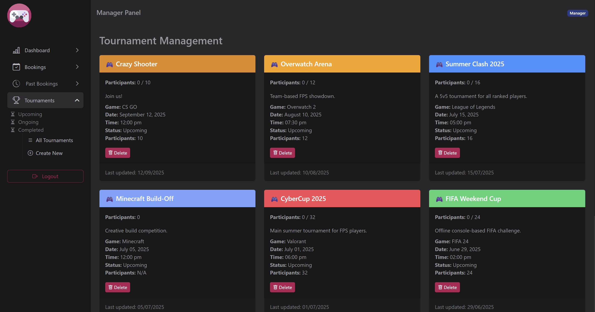

# 🎮 CyberClub

CyberClub is a C# ASP.NET Core web application for managing gaming club operations such as seat bookings, user accounts, and tournament organization. The system supports both Customer and Manager roles, providing scheduling, availability tracking, and admin-level controls.

---

## ✨ Features

### 🧑‍💻 Customer Panel
- Browse zones and check available seats
- Book a seat for a specific time and duration
- View and manage personal bookings

---

### 🛠 Manager Panel
- View all user bookings
- Create, update, and manage tournaments
- Access system analytics and reports

---

### 🔐 User Management
- User registration and authentication using hashed passwords with salt
- Role-based access (Customer, Manager)
- Extended profile information (DOB, phone number, etc.)

---

## 🧰 Technologies Used

### 🖥 Backend
- **ASP.NET Core MVC** – for building the web application
- **C#** – main language
- **ADO.NET (SqlClient)** – direct SQL query execution
- **SQL Server** – relational database engine
- **Entity Validation** – via `System.ComponentModel.DataAnnotations`

### 🔐 Security
- **Hashed passwords with salt**
- **Role-based Authorization**
- **Session management**

### 🗃 Database
- **Schema via `script222.sql`**
- Key Tables: `User`, `Seat`, `Booking`, `Tournament`, `Zone`, `Role`, `Equipment`
- **Stored procedures** for automatic seat release

### 🛠 Dev Tools
- **Visual Studio / VS Code**
- **.NET CLI**
- **SQL Server Management Studio**

### 🌐 Frontend (Server-rendered)
- **Razor (CSHTML)**
- **Bootstrap or custom styles**

---

## 📂 Project Structure

- `Controllers/` – MVC Controllers for both roles
- `Domain/` – Models, Services, Enums, Validators
- `Infrastructure/` – SQL-powered Repositories
- `ViewModels/` – UI-binding view models
- `wwwroot/images/` – Static images used in views and documentation

---

## 📜 License

This project is provided for educational purposes. Contact the author for reuse permissions or academic references.
